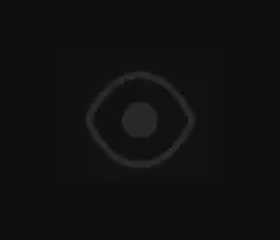

# Blink4 — a tiny macOS app that reminds you to blink

<p align="center">
  
</p>

<p align="center">
  <b>A 44×34 floating eye that blinks every 4 seconds.</b><br>
  Free, open source, no account, no network, ~80 KB.<br>
  Apple Silicon + Intel · macOS 12 or newer
</p>

<p align="center">
  <a href="https://github.com/imhkr/Blink4/releases/latest">Download the DMG</a> ·
  <a href="#install">Install</a> ·
  <a href="#privacy-and-security">Privacy</a> ·
  <a href="#contributing">Contribute</a>
</p>

---

## Why you need this

Staring at a screen cuts your blink rate by about two thirds. At rest people blink
**15–20 times a minute** — roughly **one blink every 3–4 seconds**. In front of a monitor
that collapses to **5–7 times a minute**, and the blinks that do happen are often partial.
That is the main mechanical cause of the dry, gritty, burning eyes that come with a long
day of work — the tear film evaporates and nothing spreads a fresh one.

The fix is not complicated. You just have to remember. Blink4 is that reminder: an eye that
blinks at the rate yours should, sitting quietly in the corner of your screen. You blink back
without thinking about it.

It pairs well with the 20-20-20 rule (every 20 minutes, look at something 20 feet away for
20 seconds), which fixes focus strain — a different problem from dryness.

## The part that matters: it is not distracting

Most reminder apps interrupt you. Notifications, banners, countdown timers, progress rings —
all of it is motion and text your peripheral vision keeps re-checking while you are trying
to think.

Blink4 has no timer, no numbers, no progress bar and no notifications. The pop sits at
**16% opacity**, which is genuinely hard to see, and *nothing on your screen changes* between
blinks. Once every 4 seconds it fades up, blinks once, and fades back down. That single
movement is the whole interface.

It also costs nothing to leave running: the blink is handed to Core Animation and the app
itself sleeps in between, measuring **0.03–0.18% CPU**.

## Install

1. Download `Blink4-1.0.0.dmg` from the [latest release](https://github.com/imhkr/Blink4/releases/latest).
2. Open it and drag **Blink4** to **Applications**.
3. **First launch:** right-click the app → **Open** → **Open**. macOS blocks it on a normal
   double-click because the app is ad-hoc signed, not notarised by Apple (notarisation needs a
   paid Apple Developer account). On macOS 15+ you may instead need
   **System Settings → Privacy & Security → Open Anyway**.

   Prefer the command line?

   ```sh
   xattr -dr com.apple.quarantine /Applications/Blink4.app
   ```

   If you would rather trust nothing you did not build, [build it from source](#build-from-source) —
   it takes about ten seconds.

There is no dock icon and no menu bar item. The eye *is* the app.

## Usage

| Action | What it does |
|---|---|
| Drag anywhere on it | Move it to any corner of any screen |
| Hover | Fades to full opacity so you can find and grab it |
| Double-click | Pause / resume |
| Right-click | Interval (4 / 5 / 10 / 20 / 60 s), pause, quit |

Its position and interval are remembered between launches. It stays above other windows,
follows you across Spaces, and stays visible over full-screen apps.

## Privacy and security

A blinking eye that watches your screen would be a great disguise for something nasty, so
here is exactly what it does, and how to check rather than take my word for it.

**It does not:** connect to the internet, read or write your files, read the clipboard, watch
the keyboard, capture the screen, touch the Keychain, run other programs, load plugins, log
anything, or phone home. There is no analytics, no update check, no telemetry.

**It does:** store two values in its own preferences (`com.imhkr.blink4`) — your chosen
interval and the window position — and watch **mouse-movement events** so it can tell when
your pointer is over the pop and reveal it. That is `NSEvent.addGlobalMonitorForEvents` for
`.mouseMoved` and `.leftMouseDragged` only ([main.swift](Sources/main.swift)). It receives
cursor coordinates, nothing else: no keystrokes, no clicks in other apps, and it requires no
Accessibility permission. Every event is thrown away immediately after a rectangle check.

Verify it yourself on the downloaded app — these are the checks I run:

```sh
# every library it links against: Apple system frameworks only
otool -L /Applications/Blink4.app/Contents/MacOS/Blink4

# no networking, no process spawning, no keychain symbols
nm -u /Applications/Blink4.app/Contents/MacOS/Blink4 | grep -iE 'socket|connect|URLSession|posix_spawn|keychain'

# watch it make zero network connections while running
sudo lsof -i -a -p "$(pgrep -x Blink4)"
```

The entire app is **236 lines of Swift in one file** that you can read in five minutes. That
is deliberate: a program this small is one you can audit rather than trust.

## Build from source

```sh
git clone https://github.com/imhkr/Blink4.git
cd Blink4
./build.sh
open Blink4.app
```

No Xcode project, no package manager, no dependencies — just `swiftc` from the Command Line
Tools. `build.sh` compiles for arm64 and x86_64, `lipo`s them into one universal binary, wraps
it in an `.app` bundle and ad-hoc signs it.

## Contributing

Issues and pull requests are welcome — this is a small app and it should stay small.

Good first contributions:

- **A Windows build.** The app is ~200 lines of logic; a WinUI/Win32 port is a weekend.
- Launch at login, without adding a dependency.
- Idle detection: skip blinks while you are away from the keyboard.
- A quieter or louder blink (animation timing lives in the constants at the top of `main.swift`).

Two rules: no new dependencies unless they earn their place, and nothing that sends data
anywhere. Keep the privacy section above true.

## FAQ

**Why 4 seconds and not 5, or 20?** 4 s is the natural resting blink interval (15–20 blinks
per minute). Longer intervals are more comfortable but train nothing; if 4 s is too much while
you are concentrating, right-click and pick 5 or 10.

**Does it work on Intel Macs?** Yes, the release binary is universal.

**Does it need Accessibility or Screen Recording permission?** No. Neither.

**Will it show up in screen shares and recordings?** Yes, it is an ordinary floating window.
Double-click it to pause before a demo.

**Is there a Windows version?** Not yet — see [contributing](#contributing).

## License

MIT — see [LICENSE](LICENSE).

---

<sub>Keywords: blink reminder, dry eyes, eye strain, computer vision syndrome, digital eye
strain, macOS menu bar app, blink rate, 20-20-20 rule, open source mac app, free eye care app.</sub>
